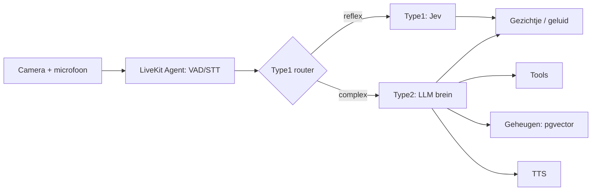

# Animus — AI Robotje Projectbeschrijving

2026-09-22 · @Someone

## Visie & doel

Het doel is een AI-robotje, genaamd Animus, te bouwen dat écht "tot leven" aanvoelt, niet enkel een chatbot met een gezichtje. Het robotje:

- heeft een **wisselbaar brein** (Claude, Gemini, OpenAI, of open source), los van de rest van het systeem
- heeft een **geheugen dat groeit** doorheen zijn bestaan
- heeft een **eigen karakter** dat het zelf kiest bij zijn "geboorte" en dat nadien evolueert
- kan **emoties tonen** via een monochroom gezichtje (ogen, wenkbrauwen, mond) op een scherm
- kan **zien** via een camera en **horen/praten** via spraak
- kan **tools gebruiken**, later ook fysieke motoren en sensoren

**Fasering:** eerst een softwareprototype op de computer (brein, geheugen, karakter, gezichtje, spraak), daarna een port naar een Raspberry Pi met motoren, camera en schermpje.

**Stack-keuze:** Node.js/TypeScript, aansluitend bij bestaande Next.js-ervaring en infrastructuur (PostgreSQL, Coolify, Hetzner, Cloudflare).

## Architectuuroverzicht

Het systeem bestaat uit losse, communicerende modules zodat elk stuk apart vervangbaar blijft:

1. **Perceptie** — camera (vision), microfoon (spraak-naar-tekst)
2. **Brein** — Type1 (snel/reflexief) + Type2 (traag/redenerend, de LLM)
3. **Geheugen** — kort- en langetermijn
4. **Karakter/identiteit** — een laag die gedrag en persoonlijkheid kleurt
5. **Tools/acties** — functies die het robotje kan aanroepen, later ook motoren/sensoren
6. **Expressie** — gezichtje (scherm), stem (TTS), geluiden

**Monorepo-opbouw** (pnpm workspaces + Turborepo): LiveKit-agent, brein-API, gezichtje-app, dashboard-app, later een aparte CV-microservice voor de Pi.

## Het brein — Type1 & Type2

**Type2 (het "praat"-brein):** een LLM (Claude, Gemini, GPT, of open source via Ollama) voor gesprek, planning, tool-gebruik en redeneren over nieuwe situaties. Wisselbaar gemaakt via de **Vercel AI SDK**: één interface, provider wisselt via een parameter.

**Type1 (het "reflex"-brein):** snelle, goedkope classificatie/beslissingen die geen taalgeneratie nodig hebben — via **Jev** (TypeSafe's "System One Model"), dat typed decisions met een waarschijnlijkheidsscore teruggeeft in plaats van tekst, sub-100ms en zeer goedkoop ($0,042 per 1M input-tokens, output gratis).

**Vuistregel voor de router:** output past in een vaste set categorieën/getallen, geen zin nodig → Type1. Er is een zin, plan, of oordeel over iets nieuws nodig → Type2.

**Type1-taken:**

- Perceptie-filtering (is er een gezicht? interessant genoeg voor Type2?)
- Emotielabel + intensiteit uit toon/tekst
- Intent-routering (simpele vraag vs. complexe babbel)
- Veiligheid & fysieke controlegrenzen (fase 3)
- Turn-taking (grotendeels al gedekt door LiveKit's ingebouwde endpointing-model)
- Nieuwsgierigheids-trigger ("is dit de moeite om spontaan iets te zeggen?")

**Type2-taken:**

- Het gesprek voeren, karakter-consistente antwoorden
- Planning & tool-orchestratie, multi-stap taken
- Vision-interpretatie (de volledige scène duiden, niet enkel detecteren)
- Reflectie op geheugen/ervaringen, karakterevolutie
- Nieuwe taken combineren met bestaande tools

**Extra kostenlaag — Type2-licht vs. Type2-zwaar:** alledaagse babbel via een goedkoper model (bv. Claude Haiku 4.5), complexere taken (planning, vision) via een sterker model (bv. Claude Sonnet 5) — ook gewoon een parameter in dezelfde Vercel AI SDK-abstractie.

**Orchestratie:** een **eigen lichte state machine** (Type1-check → Type2 indien nodig → actie) in plaats van LangGraph.js — voor de schaal van dit project makkelijker te doorgronden en te debuggen; LangGraph.js blijft een optie mocht de logica later complexer worden.

## Geheugen

**Kort-termijn/werkgeheugen:** de lopende conversatie/context, bijgehouden in de state machine tijdens de sessie.

**Lang-termijn/groeiend geheugen:** PostgreSQL + **pgvector** (hergebruikt bestaande infrastructuur), met embeddings via Voyage AI of OpenAI `text-embedding-3-small`. Het Type2-brein haalt relevante geheugens op (RAG) vóór het antwoordt.

**Ervaringsgeheugen (voor fysieke tools/motoren):** een aparte `experiences`-tabel waarin elke actie + resultaat wordt opgeslagen ("ik probeerde de arm 90° te draaien, dit veroorzaakte X"). Bij toekomstige beslissingen haalt het brein relevante ervaringen op — zo bouwt het robotje ervaring op zonder een apart reinforcement-learning-traject.

**Per-persoon geheugen (mogelijke uitbreiding):** een `person_id` op de bestaande tabellen, zodat het robotje een aparte band per gebruiker kan opbouwen wanneer het meerdere mensen leert onderscheiden (stem/gezicht).

**Reflectie-loop:** een periodieke Type2-taak (zie Identiteit & karakter) leest recente geheugens en herschrijft er een samenvatting van — dit is ook de basis voor het droom-mechanisme.

## Identiteit & karakter

### Genesis — de "geboorte"

Bij de allereerste boot (geen `identity`-record in de database) start een eenmalige genesis-flow: Type2 krijgt een system prompt zonder vooraf vastgelegde naam/persoonlijkheid, plus een random "seed" (abstracte woorden of initiële trekjes) als vertrekpunt, en kiest zelf een naam + eerste karakterbeschrijving + geboorteverhaal. Resultaat wordt opgeslagen in één `identity`-record. Dit gebeurt letterlijk maar één keer.

### Evolutie — karakter dat verandert

Twee lagen:

- **Kern (vrijwel onveranderlijk):** de basistrekjes gekozen bij genesis — het "temperament"
- **Geëvolueerd deel:** periodiek bijgewerkt door een reflectie-taak (Type2) die terugkijkt op recente ervaringen en het karakterprofiel herschrijft, met een grens op hoeveel het per reflectie mag verschuiven (voorkomt abrupte identiteitswissels)

### Leeftijd

Gebaseerd op `born_at` (kalendertijd sinds genesis) — het robotje veroudert ook terwijl het uitstaat, zoals een levend wezen dat slaapt maar blijft bestaan. *(open vraag hieronder: bevestigen dat dit de gewenste aanpak is t.o.v. enkel actieve-tijd)*

### Aan/uit vs. verwijderen

- **Uit-/aanzetten:** proces stoppen/starten; alles (identiteit, geheugen, karakter) staat in Postgres/pgvector, dus niets gaat verloren — bij herstart wordt hetzelfde record ingeladen. Niets verandert.
- **Volledig verwijderen:** een expliciete, onomkeerbare actie die het `identity`-record én alle geheugentabellen/embeddings hard verwijdert. Na verwijdering start de genesis-flow opnieuw op en ontstaat een **volledig nieuw wezen** (nieuwe naam, nieuw karakter) — geen reset naar dezelfde robot.

### Verjaardag

Afgeleid van `born_at`: een dagelijkse check vergelijkt de huidige datum met de geboortedag. Op die dag: aangepaste system-prompt-flag ("het is vandaag je verjaardag, je bent nu X jaar"), blijere emotie-baseline, en het robotje beslist zelf of/hoe het dit vermeldt.

### Nieuwsgierigheid/initiatief

Type1 doet een periodieke of event-getriggerde check ("is er nu iets de moeite waard om spontaan iets over te zeggen?", bv. na X minuten stilte of een onbekend object in beeld). Enkel bij een positieve trigger wordt Type2 opgeroepen om er iets concreets mee te doen — houdt de kost laag (zie Kostenbeheersing).

### Dromen

Een geplande job (bv. nachtelijk of na lange idle-tijd) laat Type2 een korte, associatieve/surrealistische reflectietekst genereren op basis van recente ervaringen + karakterprofiel. Opslag in een aparte `dreams`-tabel. Wordt zeldzaam (niet elke keer) aangehaald in gesprek om speciaal te blijven.

## Emoties & het gezicht

**Visuele stijl** (referentie: blob-vormige ogen + mond op gekleurde achtergrond, geen realistische ogen of complex rig-systeem):

- **Oogvorm** — rond, halve maan/gesloten, scheef, groot/klein, pupil-positie
- **Mondkromming** — bezier-curve, van diepe glimlach tot zigzag (ergernis) tot recht streepje (neutraal)
- **Achtergrondkleur** — verschuift mee met de emotie (geel = blij, rood/oranje = boos/ongeduldig, blauw = kalm)
- Wenkbrauwen: optioneel, *(open vraag hieronder)*

**Techniek:**

- Elke emotie = een keyframe-object (oogvorm/scale/pupil-offset per oog, mond-beziercurve, achtergrondkleur)
- Bij een emotiewissel wordt getweend tussen huidig en doel-keyframe (\~300-500ms) voor een vloeiend, levend gevoel
- **React + SVG**, met **Framer Motion** voor de interpolatie en evt. **Flubber** voor het morphen tussen wezenlijk verschillende oogvormen
- Fase 1: webapp op de computer; fase 3: dezelfde app in kiosk-mode (Chromium) op het Pi-schermpje — geen herbouw nodig

**Koppeling met het brein:**

- Type1 (Jev) bepaalt continu `{emotion, intensity}` uit toon/context, doorgestuurd via WebSocket of een LiveKit data channel naar het gezichtje — dit hoeft niet te wachten op de volledige Type2-redenering

**Extra expressiemodi:**

- **Zelf geluiden maken** — korte audioclips (kirren, zuchten, brommen) getriggerd door emotiewissels, geen LLM-call nodig
- **Doodle-modus** — bij lange idle-tijd schakelt het canvas over naar een genererende/procedurele tekening in dezelfde monochrome stijl, puur lokale animatie

## Spraak

**LiveKit Agents (Node.js, `@livekit/agents`, 1.0)** vormt de volledige realtime voice-pipeline: audio-in/uit via WebRTC, Voice Activity Detection (Silero), turn-detection (ingebouwd endpointing-model, reduceert onderbrekingen — dekt een groot deel van de Type1-turn-taking-behoefte zonder extra werk), en plugbare STT/TTS-providers achter één `AgentSession`-abstractie.

- **STT:** Deepgram
- **TTS:** ElevenLabs voor speciale/emotionele momenten (meerdere stemmen, hoge kwaliteit); een goedkopere stem (bv. Deepgram Aura) voor alledaagse babbel, als kostenhefboom

**Later voordeel (fase 3):** het robotje zit als "participant" in een LiveKit-room, waardoor een telefoon/webapp later kan meeluisteren/kijken of het op afstand aansturen — handig voor debugging op de Pi.

## Zicht/camera

Twee sporen, te combineren:

- **Type1 — snelle, continue detectie:** lokale CV via **MediaPipe** (lichte JS/WASM-variant, draait in Node zonder aparte service) voor gezichtsdetectie/aanwezigheid/beweging op 10-30fps. Triggert pas de dure Type2-vision-call wanneer iets écht interessant is.
- **Type2 — de volledige interpretatie:** multimodale LLM-input (Claude/GPT/Gemini kunnen beelden direct verwerken via dezelfde Vercel AI SDK) om een scène te beschrijven/duiden wanneer Type1 groen licht geeft.

**Hoofdvolggedrag (fase 3, Pi):** Type1-taak (face/object-detectie → coördinaat → pan/tilt-hoek voor servo's), volledig los van het Type2-brein, continue feedback-loop zonder LLM-call per frame. Audio-richting (indien microfoon-array) kan voorrang geven op wat de camera ziet.

*Indien de CV-behoefte later zwaarder wordt dan MediaPipe aankan (bv. YOLO), dan als aparte Python-microservice ernaast — breekt de Node-architectuur niet, wordt gewoon een extra "sense"-service.*

## Overige features

*(Dromen, verjaardag en nieuwsgierigheid staan uitgewerkt onder Identiteit & karakter; hoofdvolggedrag, zelf geluiden en doodle-modus onder Zicht/camera en Emoties & het gezicht.)*

**Klein dashboard:** een Next.js-pagina die rechtstreeks connecteert met dezelfde Postgres-database — toont karakterprofiel (kern + geëvolueerd deel), recente geheugens/dromen, huidige emotie/energie, leeftijd, activiteitenlog. Later ook een handmatige "override"-plek (emotie forceren, herinnering toevoegen/verwijderen) en het Langfuse-kostendashboard (zie Kostenbeheersing).

**Modelwissel-experiment:** een dropdown in het dashboard om het actieve Type2-model tijdens een sessie te wisselen (Claude/Gemini/OpenAI/lokaal), om te observeren hoe het karakter subtiel verschuift per onderliggend model — meteen ook een test of de architectuur écht modelonafhankelijk is. Kost = enkel tijdens bewust testen, geen doorlopende productiekost.

## Kostenbeheersing

**Aanpak:** elke feature routeren via Type1 (Jev, \~$0,042/1M input-tokens, output gratis) waar mogelijk, en Type2 pas inschakelen na een positieve Type1-trigger. Dit is het verschil tussen bv. de nieuwsgierigheid-feature op \~$1/maand houden versus $200-400/maand als elke check rechtstreeks naar Type2 zou gaan.

**Grootste kostenpost is niet de "levende" features, maar de gewone spraakinteractie** — vooral TTS (ElevenLabs ligt in de orde van $0,05-0,10/minuut audio, bij 30 min/dag al snel tientallen euro per maand). Hefbomen:

- Goedkopere TTS-stem (Deepgram Aura) voor gewone babbel, duurdere/mooiere stem (ElevenLabs) enkel voor speciale momenten
- Prompt caching op systeemprompt + karakterprofiel
- Type2-licht (Haiku) vs. Type2-zwaar (Sonnet) afhankelijk van taakcomplexiteit

**Monitoring:** **Langfuse** (open source, MIT, zelf te hosten op de bestaande Hetzner/Coolify-infrastructuur) voor live tracing en per-feature kostenopsplitsing, i.p.v. manueel te blijven schatten.

## Technologiestack

| Laag | Technologie |
| --- | --- |
| Taal & runtime | Node.js / TypeScript |
| Monorepo | pnpm workspaces + Turborepo |
| Type2-brein (wisselbaar) | Vercel AI SDK (`ai` + providerpakketten: Anthropic, OpenAI, Google, Ollama) |
| Type1-brein | Jev (TypeSafe System One Model) |
| Orchestratie | Eigen lichte state machine (LangGraph.js als latere optie) |
| Tool-schema's | Zod |
| Realtime spraak | LiveKit Agents (Node.js, `@livekit/agents`) |
| STT | Deepgram |
| TTS | ElevenLabs (premium) + Deepgram Aura (goedkoop, alledaags) |
| Database | PostgreSQL + pgvector |
| ORM | Drizzle |
| Embeddings | Voyage AI of OpenAI `text-embedding-3-small` |
| Achtergrondtaken | BullMQ + Redis |
| Gezichtje | React + SVG + Framer Motion (+ Flubber voor vorm-morphing) |
| Realtime signaal brein→gezicht | WebSocket of LiveKit data channel |
| Dashboard | Next.js (zelfde DB) |
| Kostenmonitoring | Langfuse (zelf gehost) |
| Vision — Type1 | MediaPipe (JS/WASM) |
| Vision — Type2 | Multimodale LLM-call via Vercel AI SDK |
| Motoraansturing (Pi, fase 3) | johnny-five (Node.js GPIO/robotica) |
| Schermpje (Pi, fase 3) | Chromium in kiosk-mode, zelfde gezichtje-app |
| Testing | Vitest |
| Infrastructuur | Coolify op Hetzner, achter Cloudflare (bestaande setup) |

## Roadmap

**Fase 1 — computer-prototype:** Type2-brein (wisselbaar via Vercel AI SDK) + genesis-flow (naam/karakter) + basisgeheugen (pgvector) + tools + gezichtje op scherm (React/SVG) + STT/TTS via LiveKit + Type1-router (Jev) voor emotie/turn-taking + dashboard. Nog geen camera/motoren — puur om de "geest" en het karakter te valideren.

**Fase 2 — uitbreiding op de computer:** Camera + MediaPipe (Type1-perceptie) + volledige feature-set (dromen, verjaardag, nieuwsgierigheid, zelf geluiden, doodle-modus) + Langfuse-kostenmonitoring + modelwissel-experiment in het dashboard.

**Fase 3 — Raspberry Pi + motoren:** Alles porteren naar de Pi, motoraansturing (johnny-five) gekoppeld aan de tool-laag, hoofdvolggedrag via servo's, schermpje in kiosk-mode voor het gezichtje, ervaringsgeheugen voor fysieke acties, veiligheidslaag (Type1) voor motorbewegingen, privacy-maatregelen (mute-knop, luister-indicator, wake-word).

## Open vragen & nog te beslissen punten

- [ ] **Leeftijd:** doorlopen tijdens uitgeschakelde periodes (kalendertijd), of enkel actieve/aan-tijd? Voorstel in dit document: kalendertijd.
- [ ] **Wenkbrauwen:** volledig weglaten (oog + mond + achtergrondkleur, zoals het referentiebeeld) of toch behouden voor extra nuance bij bv. verrassing/boosheid?
- [ ] **Verwijderen — "grafschrift":** bij volledige verwijdering, een klein archief (naam, leeftijd, laatste woorden) bewaren dat de nieuwe robot nooit kan lezen, puur voor jou als eigenaar? Of moet verwijderen echt alles wissen zonder sporen?
- [ ] **Local-only fallback:** momenteel is alles API-gebaseerd (geen lokale modellen vereist) — blijft dat zo, of moet er op termijn een lokaal model (via Ollama) als noodoptie inzitten?
- [ ] **Meerdere gebruikers:** wordt het per-persoon-geheugen (aparte band per gebruiker, stem/gezicht-herkenning) effectief meegenomen in fase 2, of blijft het bij één primaire gebruiker?
