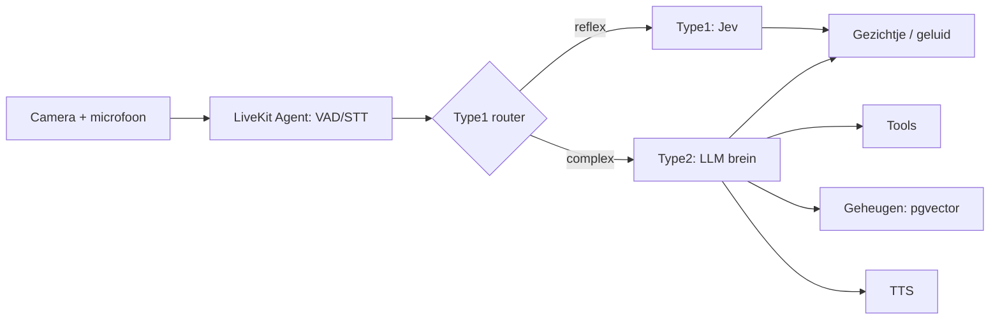

# Animus — AI Robotje Projectbeschrijving

2026-09-22 · @Someone

## Visie & doel

Het doel is een AI-robotje, genaamd Animus, te bouwen dat écht "tot leven" aanvoelt, niet enkel een chatbot met een gezichtje. Het robotje:

- heeft een **wisselbaar brein** (Claude, Gemini, OpenAI, of open source), los van de rest van het systeem
- heeft een **geheugen dat groeit** doorheen zijn bestaan
- heeft een **eigen karakter** dat het zelf kiest bij zijn "geboorte" en dat nadien evolueert
- kan **emoties tonen** via een monochroom gezichtje (ogen, wenkbrauwen, mond) op een scherm
- kan **zien** via een camera en **horen/praten** via spraak
- kan **tools gebruiken**, later ook fysieke motoren en sensoren

**Fasering:** eerst een softwareprototype op de computer (brein, geheugen, karakter, gezichtje, spraak), daarna een port naar een Raspberry Pi met motoren, camera en schermpje.

**Stack-keuze:** Node.js/TypeScript, aansluitend bij bestaande Next.js-ervaring en infrastructuur (PostgreSQL, Coolify, Hetzner, Cloudflare).

## Architectuuroverzicht

Het systeem bestaat uit losse, communicerende modules zodat elk stuk apart vervangbaar blijft:

1. **Perceptie** — camera (vision), microfoon (spraak-naar-tekst)
2. **Brein** — Type1 (snel/reflexief) + Type2 (traag/redenerend, de LLM)
3. **Geheugen** — kort- en langetermijn
4. **Karakter/identiteit** — een laag die gedrag en persoonlijkheid kleurt
5. **Tools/acties** — functies die het robotje kan aanroepen, later ook motoren/sensoren
6. **Expressie** — gezichtje (scherm), stem (TTS), geluiden

**Monorepo-opbouw** (pnpm workspaces + Turborepo): LiveKit-agent, brein-API, gezichtje-app, dashboard-app, later een aparte CV-microservice voor de Pi.

## Het brein — Type1 & Type2

**Type2 (het "praat"-brein):** een LLM (Claude, Gemini, GPT, of open source via Ollama) voor gesprek, planning, tool-gebruik en redeneren over nieuwe situaties. Wisselbaar gemaakt via de **Vercel AI SDK**: één interface, provider wisselt via een parameter.

**Type1 (het "reflex"-brein):** snelle, goedkope classificatie/beslissingen die geen taalgeneratie nodig hebben — via **Jev** (TypeSafe's "System One Model"), dat typed decisions met een waarschijnlijkheidsscore teruggeeft in plaats van tekst, sub-100ms en zeer goedkoop ($0,042 per 1M input-tokens, output gratis).

**Vuistregel voor de router:** output past in een vaste set categorieën/getallen, geen zin nodig → Type1. Er is een zin, plan, of oordeel over iets nieuws nodig → Type2.

**Type1-taken:**

- Perceptie-filtering (is er een gezicht? interessant genoeg voor Type2?)
- Emotielabel + intensiteit uit toon/tekst
- Intent-routering (simpele vraag vs. complexe babbel)
- Veiligheid & fysieke controlegrenzen (fase 3)
- Turn-taking (grotendeels al gedekt door LiveKit's ingebouwde endpointing-model)
- Nieuwsgierigheids-trigger ("is dit de moeite om spontaan iets te zeggen?")

**Type2-taken:**

- Het gesprek voeren, karakter-consistente antwoorden
- Planning & tool-orchestratie, multi-stap taken
- Vision-interpretatie (de volledige scène duiden, niet enkel detecteren)
- Reflectie op geheugen/ervaringen, karakterevolutie
- Nieuwe taken combineren met bestaande tools

**Extra kostenlaag — Type2-licht vs. Type2-zwaar:** alledaagse babbel via een goedkoper model (bv. Claude Haiku 4.5), complexere taken (planning, vision) via een sterker model (bv. Claude Sonnet 5) — ook gewoon een parameter in dezelfde Vercel AI SDK-abstractie.

**Orchestratie:** een **eigen lichte state machine** (Type1-check → Type2 indien nodig → actie) in plaats van LangGraph.js — voor de schaal van dit project makkelijker te doorgronden en te debuggen; LangGraph.js blijft een optie mocht de logica later complexer worden.

## Geheugen

**Kort-termijn/werkgeheugen:** de lopende conversatie/context, bijgehouden in de state machine tijdens de sessie.

**Lang-termijn/groeiend geheugen:** PostgreSQL + **pgvector** (hergebruikt bestaande infrastructuur), met embeddings via Voyage AI of OpenAI `text-embedding-3-small`. Het Type2-brein haalt relevante geheugens op (RAG) vóór het antwoordt.

**Ervaringsgeheugen (voor fysieke tools/motoren):** een aparte `experiences`-tabel waarin elke actie + resultaat wordt opgeslagen ("ik probeerde de arm 90° te draaien, dit veroorzaakte X"). Bij toekomstige beslissingen haalt het brein relevante ervaringen op — zo bouwt het robotje ervaring op zonder een apart reinforcement-learning-traject.

**Per-persoon geheugen (mogelijke uitbreiding):** een `person_id` op de bestaande tabellen, zodat het robotje een aparte band per gebruiker kan opbouwen wanneer het meerdere mensen leert onderscheiden (stem/gezicht).

**Reflectie-loop:** een periodieke Type2-taak (zie Identiteit & karakter) leest recente geheugens en herschrijft er een samenvatting van — dit is ook de basis voor het droom-mechanisme.

## Identiteit & karakter

### Genesis — de "geboorte"

Bij de allereerste boot (geen `identity`-record in de database) start een eenmalige genesis-flow: Type2 krijgt een system prompt zonder vooraf vastgelegde naam/persoonlijkheid, plus een random "seed" (abstracte woorden of initiële trekjes) als vertrekpunt, en kiest zelf een naam + eerste karakterbeschrijving + geboorteverhaal. Resultaat wordt opgeslagen in één `identity`-record. Dit gebeurt letterlijk maar één keer.

### Evolutie — karakter dat verandert

Twee lagen:

- **Kern (vrijwel onveranderlijk):** de basistrekjes gekozen bij genesis — het "temperament"
- **Geëvolueerd deel:** periodiek bijgewerkt door een reflectie-taak (Type2) die terugkijkt op recente ervaringen en het karakterprofiel herschrijft, met een grens op hoeveel het per reflectie mag verschuiven (voorkomt abrupte identiteitswissels)

### Persoonlijkheid — MBTI-type met glijdende assen

Elk wezen heeft een van de 16 MBTI-types, maar elke as is intern een getal (0–1); de letter volgt uit de kant van het midden waarop het getal ligt (bv. I/E = 0,3 → I).

| As | Stuurt |
|----|--------|
| **I ↔ E** | **Spraakzaamheid:** hoe lang en uitweidend het antwoordt, rechtstreeks afgeleid van deze as (sterk introvert: meestal één korte zin; sterk extravert: vertelt graag, vraagt terug, maakt zijsprongen) |
| **S ↔ N** | concreet en praktisch vs. associatief en fantasierijk (raakt ook de dromen) |
| **T ↔ F** | zakelijk redeneren vs. vanuit gevoel en warmte reageren |
| **J ↔ P** | gestructureerd en afgerond vs. speels en open |

- **Genesis:** Type2 kiest een startpositie op elke as, geïnspireerd door de Seed, zodat elk wezen anders klinkt.
- **Evolutie:** de reflectie-taak duwt de getallen **traag**, met een grens per reflectie. Een letter wisselt pas als een as het midden passeert (INFP → ENFP): eerst "een beetje minder introvert", pas veel later een ander type. Geen sprongen.
- **Verzoeken:** zegt de gesprekspartner "praat wat minder", dan is dat geen instelling die meteen omklapt maar een ervaring die de reflectie meeweegt; het wezen beslist zelf hoeveel het zich aanpast.
- **Geen harde tokenlimiet:** die knipt zinnen middenin af, wat in spraak slecht klinkt; de assen worden in de prompt vertaald naar gedragsrichtlijnen (o.a. lengte).
- **Dashboard:** het type als label plus de vier assen als balkjes, zodat de verschuiving zichtbaar is.

**Initiatief** (hoe vaak het zelf een gesprek begint, de drempel van de nieuwsgierigheid-check hieronder) blijft een aparte knop van spraakzaamheid, zodat een zwijgzaam maar nieuwsgierig wezen kan bestaan. Voorstel: afleiden van de N- en P-kant (een INTP antwoordt kort maar komt geregeld zelf met een vraag).

Waarom MBTI met getallen i.p.v. vaste types of Big Five: de types zijn herkenbaar, en de getallen eronder laten de geleidelijke evolutie toe die vaste hokjes niet kunnen.

*Aanleiding (fase 1):* de systeemprompt zegt niets over lengte, waardoor elk wezen de lange standaardantwoorden van het model geeft — spraakzaamheid is daar nog geen deel van het karakter.

### Drijfveren — wat het wil en wat het niet wil

Naast persoonlijkheid heeft elk wezen **Drijfveren** van vijf soorten, die verschillen in horizon en in de emotie die ze oproepen:

| Soort | Wat | Voorbeeld | Emotie-effect |
|-------|-----|-----------|---------------|
| **Wens** | iets wat het graag zou hebben of meemaken (passief) | "ooit de zee horen" | blij/nieuwsgierig als het ter sprake komt |
| **Doel** | concreet, iets waar het naartoe werkt; kan bereikt of opgegeven worden | "alle namen van je vrienden leren" | blij bij vooruitgang/bereiken, teleurgesteld bij opgeven |
| **Toekomstdroom** | ver, groots, misschien onhaalbaar | "een echt lichaam hebben" | kleurt vooral de nachtelijke Dromen |
| **Afkeer** | iets wat het minder leuk vindt (mild) | "lang praten over het weer" | verveeld |
| **Ergernis** | iets waar het lastig van wordt (sterk) | "onderbroken worden" | boos, met hogere intensiteit |

- **Ontstaan:** bij genesis kiest Type2 een eerste set, passend bij de Seed en het persoonlijkheidstype.
- **Evolutie:** de reflectie-taak voegt drijfveren toe (uit gesprekken), zet doelen op bereikt/opgegeven en laat afkeren of ergernissen verzachten of versterken.
- **Opslag:** een eigen tabel (soort, tekst, status voor doelen, tijdstippen), niet enkel in de karaktertekst — zodat het dashboard ze toont, doelen een status hebben en Type1 ze gericht kan meewegen.
- **Zichtbaarheid:** het dashboard toont ze (met doel-status); in gesprek vertelt het wezen erover als het past.
- **Naamgeving:** een *Toekomstdroom* (ambitie) is iets anders dan een *Droom* (de nachtelijke droomtekst hieronder), al put die laatste er wel uit.

### Leeftijd

Gebaseerd op `born_at` (kalendertijd sinds genesis) — het robotje veroudert ook terwijl het uitstaat, zoals een levend wezen dat slaapt maar blijft bestaan. *(open vraag hieronder: bevestigen dat dit de gewenste aanpak is t.o.v. enkel actieve-tijd)*

### Aan/uit vs. verwijderen

- **Uit-/aanzetten:** proces stoppen/starten; alles (identiteit, geheugen, karakter) staat in Postgres/pgvector, dus niets gaat verloren — bij herstart wordt hetzelfde record ingeladen. Niets verandert.
- **Volledig verwijderen:** een expliciete, onomkeerbare actie die het `identity`-record én alle geheugentabellen/embeddings hard verwijdert. Na verwijdering start de genesis-flow opnieuw op en ontstaat een **volledig nieuw wezen** (nieuwe naam, nieuw karakter) — geen reset naar dezelfde robot.

### Verjaardag

Afgeleid van `born_at`: een dagelijkse check vergelijkt de huidige datum met de geboortedag. Op die dag: aangepaste system-prompt-flag ("het is vandaag je verjaardag, je bent nu X jaar"), blijere emotie-baseline, en het robotje beslist zelf of/hoe het dit vermeldt.

### Nieuwsgierigheid/initiatief

Type1 doet een periodieke of event-getriggerde check ("is er nu iets de moeite waard om spontaan iets over te zeggen?", bv. na X minuten stilte of een onbekend object in beeld). Enkel bij een positieve trigger wordt Type2 opgeroepen om er iets concreets mee te doen — houdt de kost laag (zie Kostenbeheersing).

### Dromen

Een geplande job (bv. nachtelijk of na lange idle-tijd) laat Type2 een korte, associatieve/surrealistische reflectietekst genereren op basis van recente ervaringen + karakterprofiel + Drijfveren (vooral Toekomstdromen, Wensen en Ergernissen). Opslag in een aparte `dreams`-tabel. Wordt zeldzaam (niet elke keer) aangehaald in gesprek om speciaal te blijven.

## Emoties & het gezicht

**Emotie als reactie (fase 2):** Type1 bepaalt niet de emotie van de uiting van de gesprekspartner (zoals in fase 1), maar **hoe het wezen zich erbij voelt**, met zijn Drijfveren en persoonlijkheid als context. Zegt iemand neutraal "het regent weer", dan kan een wezen met een afkeer van weerpraat zich verveeld voelen.

**Stemming (fase 2):** een emotie blijft over beurten heen hangen en dooft geleidelijk uit naar de basisemotie van het wezen, i.p.v. elke beurt op nul te beginnen — na een ergernis is het nog even kortaf.

**Emotie → reactie (fase 2):** de huidige emotie en stemming gaan mee in de Type2-prompt, zodat ze de toon kleuren (een geërgerd wezen antwoordt korter en stugger). In fase 1 ziet Type2 de emotie niet; enkel het gezichtje toont ze.

**Visuele stijl** (referentie: blob-vormige ogen + mond op gekleurde achtergrond, geen realistische ogen of complex rig-systeem):

- **Oogvorm** — rond, halve maan/gesloten, scheef, groot/klein, pupil-positie
- **Mondkromming** — bezier-curve, van diepe glimlach tot zigzag (ergernis) tot recht streepje (neutraal)
- **Achtergrondkleur** — verschuift mee met de emotie (geel = blij, rood/oranje = boos/ongeduldig, blauw = kalm)
- Wenkbrauwen: optioneel, *(open vraag hieronder)*

**Techniek:**

- Elke emotie = een keyframe-object (oogvorm/scale/pupil-offset per oog, mond-beziercurve, achtergrondkleur)
- Bij een emotiewissel wordt getweend tussen huidig en doel-keyframe (\~300-500ms) voor een vloeiend, levend gevoel
- **React + SVG**, met **Framer Motion** voor de interpolatie en evt. **Flubber** voor het morphen tussen wezenlijk verschillende oogvormen
- Fase 1: webapp op de computer; fase 3: dezelfde app in kiosk-mode (Chromium) op het Pi-schermpje — geen herbouw nodig

**Koppeling met het brein:**

- Type1 (Jev) bepaalt continu `{emotion, intensity}` uit toon/context, doorgestuurd via WebSocket of een LiveKit data channel naar het gezichtje — dit hoeft niet te wachten op de volledige Type2-redenering

**Extra expressiemodi:**

- **Zelf geluiden maken** — korte audioclips (kirren, zuchten, brommen) getriggerd door emotiewissels, geen LLM-call nodig
- **Doodle-modus** — bij lange idle-tijd schakelt het canvas over naar een genererende/procedurele tekening in dezelfde monochrome stijl, puur lokale animatie

## Spraak

**LiveKit Agents (Node.js, `@livekit/agents`, 1.0)** vormt de volledige realtime voice-pipeline: audio-in/uit via WebRTC, Voice Activity Detection (Silero), turn-detection (ingebouwd endpointing-model, reduceert onderbrekingen — dekt een groot deel van de Type1-turn-taking-behoefte zonder extra werk), en plugbare STT/TTS-providers achter één `AgentSession`-abstractie.

- **STT:** Deepgram
- **TTS:** ElevenLabs voor speciale/emotionele momenten (meerdere stemmen, hoge kwaliteit); een goedkopere stem (bv. Deepgram Aura) voor alledaagse babbel, als kostenhefboom

**Later voordeel (fase 3):** het robotje zit als "participant" in een LiveKit-room, waardoor een telefoon/webapp later kan meeluisteren/kijken of het op afstand aansturen — handig voor debugging op de Pi.

## Zicht/camera

Twee sporen, te combineren:

- **Type1 — snelle, continue detectie:** lokale CV via **MediaPipe** (lichte JS/WASM-variant, draait in Node zonder aparte service) voor gezichtsdetectie/aanwezigheid/beweging op 10-30fps. Triggert pas de dure Type2-vision-call wanneer iets écht interessant is.
- **Type2 — de volledige interpretatie:** multimodale LLM-input (Claude/GPT/Gemini kunnen beelden direct verwerken via dezelfde Vercel AI SDK) om een scène te beschrijven/duiden wanneer Type1 groen licht geeft.

**Hoofdvolggedrag (fase 3, Pi):** Type1-taak (face/object-detectie → coördinaat → pan/tilt-hoek voor servo's), volledig los van het Type2-brein, continue feedback-loop zonder LLM-call per frame. Audio-richting (indien microfoon-array) kan voorrang geven op wat de camera ziet.

*Indien de CV-behoefte later zwaarder wordt dan MediaPipe aankan (bv. YOLO), dan als aparte Python-microservice ernaast — breekt de Node-architectuur niet, wordt gewoon een extra "sense"-service.*

## Overige features

*(Dromen, verjaardag en nieuwsgierigheid staan uitgewerkt onder Identiteit & karakter; hoofdvolggedrag, zelf geluiden en doodle-modus onder Zicht/camera en Emoties & het gezicht.)*

**Klein dashboard:** een Next.js-pagina die rechtstreeks connecteert met dezelfde Postgres-database — toont karakterprofiel (kern + geëvolueerd deel), recente geheugens/dromen, huidige emotie/energie, leeftijd, activiteitenlog. Later ook een handmatige "override"-plek (emotie forceren, herinnering toevoegen/verwijderen) en het Langfuse-kostendashboard (zie Kostenbeheersing).

**Modelwissel-experiment:** een dropdown in het dashboard om het actieve Type2-model tijdens een sessie te wisselen (Claude/Gemini/OpenAI/lokaal), om te observeren hoe het karakter subtiel verschuift per onderliggend model — meteen ook een test of de architectuur écht modelonafhankelijk is. Kost = enkel tijdens bewust testen, geen doorlopende productiekost.

## Kostenbeheersing

**Aanpak:** elke feature routeren via Type1 (Jev, \~$0,042/1M input-tokens, output gratis) waar mogelijk, en Type2 pas inschakelen na een positieve Type1-trigger. Dit is het verschil tussen bv. de nieuwsgierigheid-feature op \~$1/maand houden versus $200-400/maand als elke check rechtstreeks naar Type2 zou gaan.

**Grootste kostenpost is niet de "levende" features, maar de gewone spraakinteractie** — vooral TTS (ElevenLabs ligt in de orde van $0,05-0,10/minuut audio, bij 30 min/dag al snel tientallen euro per maand). Hefbomen:

- Goedkopere TTS-stem (Deepgram Aura) voor gewone babbel, duurdere/mooiere stem (ElevenLabs) enkel voor speciale momenten
- Prompt caching op systeemprompt + karakterprofiel
- Type2-licht (Haiku) vs. Type2-zwaar (Sonnet) afhankelijk van taakcomplexiteit

**Monitoring:** **Langfuse** (open source, MIT, zelf te hosten op de bestaande Hetzner/Coolify-infrastructuur) voor live tracing en per-feature kostenopsplitsing, i.p.v. manueel te blijven schatten.

## Technologiestack

| Laag | Technologie |
| --- | --- |
| Taal & runtime | Node.js / TypeScript |
| Monorepo | pnpm workspaces + Turborepo |
| Type2-brein (wisselbaar) | Vercel AI SDK (`ai` + providerpakketten: Anthropic, OpenAI, Google, Ollama) |
| Type1-brein | Jev (TypeSafe System One Model) |
| Orchestratie | Eigen lichte state machine (LangGraph.js als latere optie) |
| Tool-schema's | Zod |
| Realtime spraak | LiveKit Agents (Node.js, `@livekit/agents`) |
| STT | Deepgram |
| TTS | ElevenLabs (premium) + Deepgram Aura (goedkoop, alledaags) |
| Database | PostgreSQL + pgvector |
| ORM | Drizzle |
| Embeddings | OpenAI `text-embedding-3-small` |
| Achtergrondtaken | Fase 1/2: simpele node-cron-taak; BullMQ + Redis pas vanaf fase 3 (retries/backoff/meerdere workers) |
| Gezichtje | React + SVG + Framer Motion (+ Flubber voor vorm-morphing) |
| Realtime signaal brein→gezicht | LiveKit data channel |
| Dashboard | Next.js (zelfde DB) |
| Kostenmonitoring | Langfuse (zelf gehost) |
| Vision — Type1 | MediaPipe (JS/WASM) |
| Vision — Type2 | Multimodale LLM-call via Vercel AI SDK |
| Motoraansturing (Pi, fase 3) | johnny-five (Node.js GPIO/robotica) |
| Schermpje (Pi, fase 3) | Chromium in kiosk-mode, zelfde gezichtje-app |
| Testing | Vitest |
| Infrastructuur | Coolify op Hetzner, achter Cloudflare (bestaande setup) |

## Roadmap

**Fase 1 — computer-prototype:** Type2-brein (wisselbaar via Vercel AI SDK) + genesis-flow (naam/karakter) + basisgeheugen (pgvector) + tools + gezichtje op scherm (React/SVG) + STT/TTS via LiveKit + Type1-router (Jev) voor emotie/turn-taking + dashboard + volledig verwijderen (met grafschrift en afscheidsreflectie — nodig om de genesis-flow herhaald te kunnen testen). Nog geen camera/motoren — puur om de "geest" en het karakter te valideren.

**Fase 2 — uitbreiding op de computer:** Camera + MediaPipe (Type1-perceptie) + volledige feature-set (dromen, verjaardag, nieuwsgierigheid, zelf geluiden, doodle-modus) + karakterevolutie via de reflectie-loop (basis voor de dromen), inclusief een MBTI-persoonlijkheid met traag verschuivende assen (spraakzaamheid via I/E, initiatief als aparte knop) + Langfuse-kostenmonitoring + modelwissel-experiment en handmatige overrides (emotie forceren, herinnering toevoegen/verwijderen) in het dashboard + Drijfveren (wensen, doelen, toekomstdromen, afkeren, ergernissen) + emotie als reactie van het wezen, met een uitdovende stemming die de toon van Type2 kleurt.

**Fase 3 — Raspberry Pi + motoren:** Alles porteren naar de Pi, motoraansturing (johnny-five) gekoppeld aan de tool-laag, hoofdvolggedrag via servo's, schermpje in kiosk-mode voor het gezichtje, ervaringsgeheugen voor fysieke acties, veiligheidslaag (Type1) voor motorbewegingen, privacy-maatregelen (mute-knop, luister-indicator, wake-word), optioneel per-persoon-geheugen (stem/gezicht-herkenning).

## Open vragen & nog te beslissen punten

Beslist tijdens de `/grill-with-docs`-sessie — zie [CONTEXT.md](CONTEXT.md) en `docs/adr/` voor de vastgelegde redenen:

- [x] **Leeftijd:** kalendertijd sinds `born_at`. Zie [ADR-0002](docs/adr/0002-leeftijd-kalendertijd.md).
- [x] **Wenkbrauwen:** toch behouden, maar enkel voor een subset van emoties (verrast, boos, bang) — de rest blijft neutraal-recht. Zie **Emotiekeyframe** in [CONTEXT.md](CONTEXT.md).
- [x] **Verwijderen — "grafschrift":** bewaren, onleesbaar voor de nieuwe robot. Zie [ADR-0003](docs/adr/0003-verwijderen-bewaart-grafschrift.md).
- [x] **Local-only fallback:** nu niet bouwen (YAGNI) — de Vercel AI SDK-abstractie maakt dit later goedkoop toevoegbaar. Heropenen zodra er een concrete aanleiding is.
- [x] **Meerdere gebruikers:** uitgesteld naar fase 3 (optioneel) — per-persoon-geheugen is geen vereiste voor fase 2.
- [ ] **Persoonlijkheid — tempo:** hoe traag is "traag"? Maximale verschuiving per reflectie, en dus hoeveel weken/maanden van gesprekken per letterwissel.
- [ ] **Persoonlijkheid — gewicht van verzoeken:** hoe zwaar weegt een expliciet verzoek ("praat wat minder") tegenover gewone ervaringen in de reflectie?
- [ ] **Stemming — tempo:** hoe snel dooft een emotie uit naar de basis, en hangt dat af van de persoonlijkheid?
- [ ] **Drijfveren — aantal:** hoeveel per soort bij genesis, en is er een maximum (zodat de prompt beheersbaar blijft)?
- [ ] **Doelen — actief nastreven:** werkt het wezen zelf aan doelen (bv. via initiatief erover beginnen), of verandert de status enkel bij reflectie?
- [ ] **Initiatief:** bevestigen dat het van de N- en P-kant afgeleid wordt (voorstel), of een eigen as/knop krijgt.
